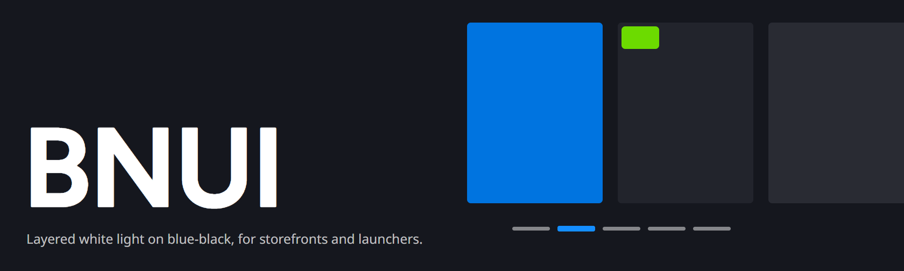
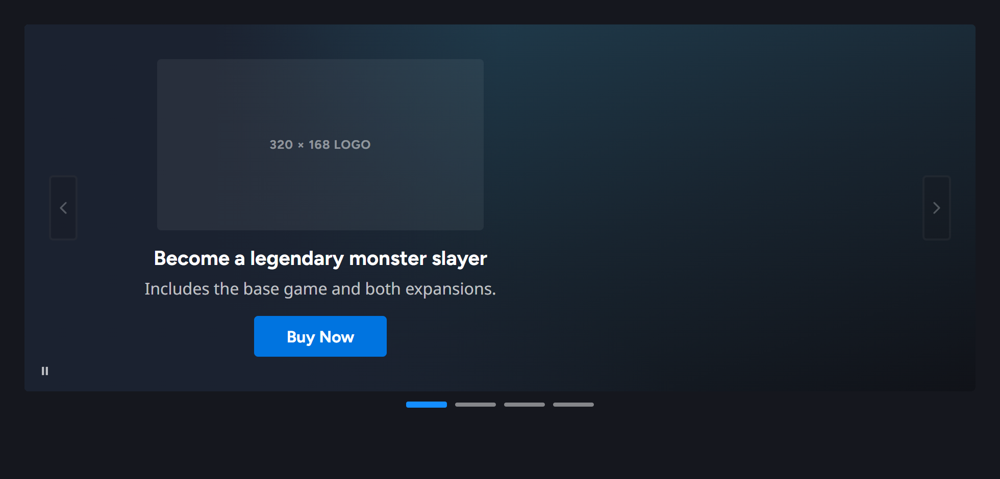
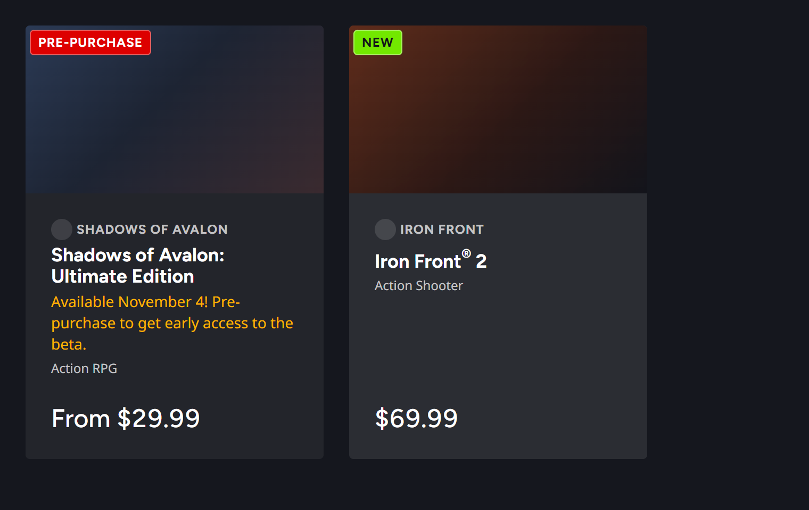
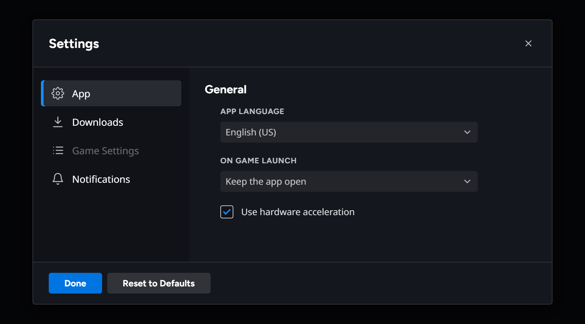
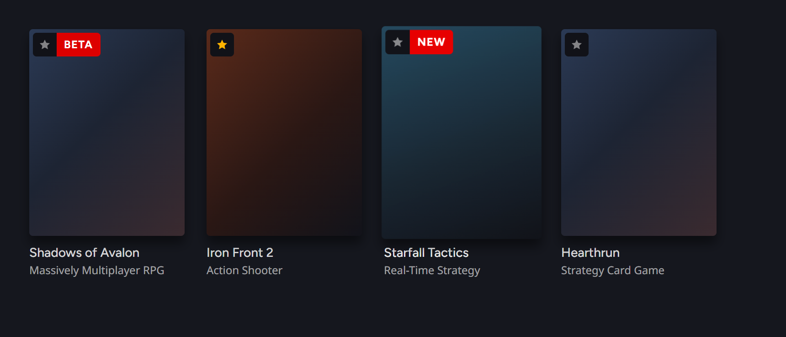
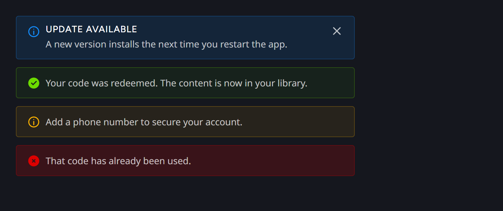
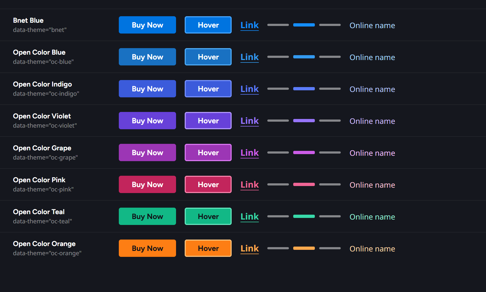

<p align="center">
  
</p>

# BNUI

BNUI is a dark design system for game storefronts, launchers and account dashboards. It is modelled on the Battle.net store, account site and desktop app. It copies Battle.net's **design tokens, styling and the way it presents content**, not the store itself.

- **Tokens:** surfaces, white-alpha fills and text, one accent, status colours, spacing, radii, rings and motion.
- **Accent themes:** Bnet Blue by default, plus 7 [Open Color](https://yeun.github.io/open-color/) accents (blue, indigo, violet, grape, pink, teal, orange), switched with `data-theme`.
- **37 components** in plain HTML + CSS (`bn-` classes), plus 4 foundation pages.
- **Interaction rules:** hovers change colour, fill or an inset ring in 100ms, never the layout. Minimal animation.

The next step is a SolidJS + Tailwind v3 implementation built on these tokens.

## Preview

<p align="center">
  
</p>

<table>
  <tr>
    <td width="50%"></td>
    <td width="50%"></td>
  </tr>
  <tr>
    <td width="50%"></td>
    <td width="50%"></td>
  </tr>
</table>

<p align="center">
  
</p>

## Components

| Group | Components |
|---|---|
| Actions | Button, IconButton, Link, Pill |
| Content | Badge, ComparisonTable, GameTile, MediaCard, MediaGallery, NewsRow, Notice, Price, ProductCard, SectionHeader |
| Dashboard | Countdown, Panel, ProgressRing, SettingsRow |
| Feedback | Alert, Toast |
| Forms | Checkbox, OptionCard, Radio, Select, Slider, TextField |
| Navigation | Breadcrumb, CarouselDots, Menu, SideNav, Tabs |
| Overlays | Dialog, Lightbox, Tooltip |
| Promotion | AnnouncementBanner, HeroCarousel |
| Social | PresenceRow |
| Foundations | Color, Type, Layout, AccentThemes |

## Repository layout

| Path | What it holds |
|---|---|
| [`design-system/project/`](design-system/project/) | The design system source: `tokens.json` (every token and accent theme), `README.md` (brand book), `components/bundle.css` (all `bn-` classes), and one folder per component with a `preview.html` and usage `README.md`. It mirrors the BNUI Design System artifact on claude.ai. |
| [`capture/`](capture/) | Reference captures of Battle.net pages, one folder per page: screenshots, accessibility snapshot, extracted CSS and tokens, hover states, and a `NOTES.md` spec. `store-home/tokens-root-resolved.json` holds the canonical resolved Battle.net tokens. |
| [`capture/_tools/cdp.mjs`](capture/_tools/cdp.mjs) | A small Chrome DevTools Protocol client for the Battle.net desktop app (CEF / Chrome 108), whose shell the DevTools MCP can't reach. |
| [`.design-sync/`](.design-sync/) | Claude Design import only. Builds the upload from `design-system/project/`: `build.py`, the design-agent conventions, measured card heights and sync notes. |
| [`docs/images/`](docs/images/) | The banner and preview images in this README. |
| [`.mcp.json`](.mcp.json) | Two Chrome DevTools MCP servers: `chrome-devtools` for the web, and `battlenet-app` attached to the desktop app on port 8888. |

## Using the styles

Build the stylesheet bundle (Python 3, no dependencies):

```sh
python .design-sync/build.py      # writes ds-bundle/ (git-ignored)
```

Then link `ds-bundle/styles.css`. It pulls in the web fonts, the token sheet and every `bn-` class:

```html
<html data-theme="oc-violet">            <!-- optional: any Open Color accent; omit for Bnet Blue -->
<link rel="stylesheet" href="ds-bundle/styles.css">

<a class="bn-card" href="#">
  <div class="bn-card__media" style="background:var(--surface-strong)"></div>
  <div class="bn-card__body">
    <div class="bn-card__eyebrow">Iron Front</div>
    <h3 class="bn-card__title">Iron Front 2</h3>
  </div>
  <div class="bn-card__foot"><span class="bn-price">$69.99</span></div>
</a>
<button class="bn-btn bn-btn--primary">Buy Now</button>
```

Lay out your own pages with tokens only, for example `var(--space-4)`, `var(--surface-raised)`, `var(--text-secondary)` and `var(--accent)`. Each component's markup and usage notes live in `design-system/project/components/<Name>/`.

To review every card locally:

```sh
python -m http.server 8765 --directory ds-bundle    # then open http://127.0.0.1:8765/.review.html
```

## Claude Design

> **Claude Design import only.** You don't need anything in this section to use BNUI's styles.

`.design-sync/` turns `design-system/project/` into the layout that Claude Design imports, so its design agent builds with BNUI's components. To re-import after a change:

1. Rebuild with `python .design-sync/build.py`.
2. Check every card in `ds-bundle/.review.html`.
3. Run `/design-sync` in Claude Code.

`.design-sync/NOTES.md` covers the details: card heights, fonts, and the upload order.

## Fonts and credits

- The display face is **Figtree** and the body face is **Noto Sans**, both from Google Fonts. Battle.net's own display face, Object Sans, is licensed and not included.
- Colour accents come from [Open Color](https://yeun.github.io/open-color/) (MIT).
- BNUI is an unofficial study of a visual language. It is not affiliated with or endorsed by Blizzard Entertainment. Battle.net and the game names in the captures are trademarks of their owners. The captures are kept as design reference only.
